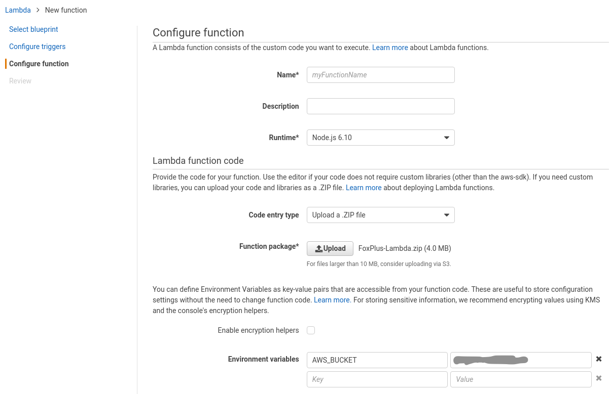

# Write SES Bounces to S3

Implements a lambda function that handles SES email bounces via SNS. 

## Prerequisites (IAM)

An IAM role with the following policy is required as the execution role for the lambda function

(`ses-bounces` refers to the AWS bucket name)

```json
{
    "Version": "2012-10-17",
    "Statement": [
        {
            "Effect": "Allow",
            "Action": [
                "logs:CreateLogGroup",
                "logs:CreateLogStream",
                "logs:PutLogEvents"
            ],
            "Resource": "arn:aws:logs:*:*:*"
        },
        {
            "Effect": "Allow",
            "Action": [
                "s3:PutObject"
            ],
            "Resource": [
                "arn:aws:s3:::ses-bounces/*"
            ]
        }
    ]
}
```

## Setup (AWS)

1. Setup a SNS topic to receive bounce notifications


2. Setup a lambda function triggered by this SNS topic


3. Run `npm install`

4. Zip the contents (including `node_modules`) of this repo and upload it (see Function package in image)



5. Set the `AWS_BUCKET` environment varaiable to the AWS bucket you want to save bounce logs to

6. Set the handler to `index.sesBounceHandler`

7. Create a new IAM role or select one with the policy shown above (Prerequisites (IAM))


8. To ensure sufficient time to execute (save to S3) increase the timeout to 30s


9. You are good to go